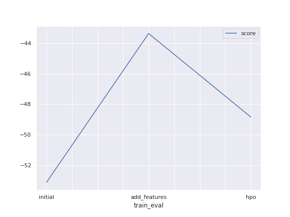

# Report: Predict Bike Sharing Demand with AutoGluon Solution

BARGAV JAGATHA

## Initial Training
### What did you realize when you tried to submit your predictions? What changes were needed to the output of the predictor to submit your results?

Trained the model with no feature engineering and no hyperparameter tuning. Got the score of 1.86412 on submission. Some additional features and hyperparameter optimization may yield better results.

### What was the top ranked model that performed?
WeightedEnsemble_L2 and KNeighborsDist came to be top ranked model on initial training.

## Exploratory data analysis and feature creation
### What did the exploratory analysis find and how did you add additional features?
Dividing datetime column to month, hour and day features may capture some seasonality or trend. So on adding those features, observing histograms, those features are expected to give some better score. So with the help of pandas, parsed the datetime column first and created those three features mentioned.

### How much better did your model preform after adding additional features and why do you think that is?
Adding those features really helped. Gave the score of 0.70325 on submission. 

## Hyper parameter tuning
### How much better did your model preform after trying different hyper parameters?
With changing hyperparameters a little, my model submission score improved to 0.55217. -->  presets = 'best_quality', num_bag_folds = 2, num_stack_levels = 2 
WeightedEnsemble_L3 is the top model here.

### If you were given more time with this dataset, where do you think you would spend more time?
There can be better set of hyperparameters (even individual model wise). I can spend more time on trying them manually. or I can apply some random search or grid search on selected subset of hyperparameters. Also we can spend some time on  data cleaning and normalization of the feature data. 

### Create a table with the models you ran, the hyperparameters modified, and the kaggle score.
|model|presets|num_bag_folds|num_stack_levels|score|
|--|--|--|--|--|
|initial|medium_quality|0|0|1.86|
|add_features|medium_quality|0|0|0.70|
|hpo|best_quality|2|2|0.55|

### Create a line plot showing the top model score for the three (or more) training runs during the project.

TODO: Replace the image below with your own.

### Create a line plot showing the top kaggle score for the three (or more) prediction submissions during the project.

TODO: Replace the image below with your own.

## Summary
This is a simple regression problem where the goal is to build a model that predicts the demand in a particular hour given some features and historical data to train on. Since this is tabular dataset, we used TabularPredictor from Autogluon which provides top most algorithms best suited for those kind of problems. Initially I trained the model with no changes in data. Later I have used the datetime attribute in feature set to create new features such as day, hour and month. This is a part of feature engineering and this is where also the exploratory analysis comes handy. With the hyperparameter optimization, the score improved to a lot better. 